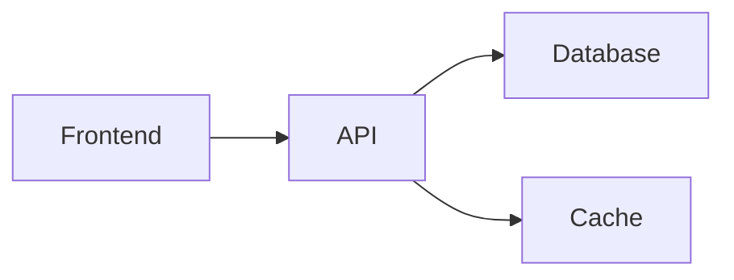

# 🎨 Excalidraw Architect - Architecture Diagrams with Perfect Auto-Layout

> Originally created by [BV-Venky](https://github.com/BV-Venky/excalidraw-architect-mcp) · Licensed under MIT  
> Packaged by [mcp-flakes](https://github.com/yourusername/mcp-flakes)

   

## 📋 What This Does

Generate beautiful Excalidraw architecture diagrams with perfect auto-layout (Sugiyama algorithm), architecture-aware styling for 50+ technologies, stateful editing, and a living architecture knowledge graph. Create, modify, and export professional diagrams with natural language - no manual layout needed.

## ⚡ Quick Start

```bash
docker run -i --rm \
  -v $(pwd)/workspace:/workspace \
  ghcr.io/mcp-flakes/excalidraw-architect-mcp:latest
```

Or install directly:
```bash
pip install excalidraw-architect-mcp[png]
# or with uvx
uvx excalidraw-architect-mcp
```

## 🎯 Perfect For

- **System architecture documentation** - Create and maintain living architecture diagrams synced with code
- **Design discussions** - Quickly visualize system proposals with proper styling and layout
- **Knowledge management** - Build a version-controlled architecture graph in `.claude/architecture.md`
- **Architecture drift detection** - Compare documented architecture against actual codebase structure

## 🛠️ Tools & Features

### Diagram Tools (5)
| Tool | Purpose | Key Parameters |
|------|---------|---------------|
| `create_diagram` | Create new diagram from structured data | `nodes[]`, `edges[]`, `title` |
| `mermaid_to_excalidraw` | Convert Mermaid syntax to Excalidraw | `mermaid_code` |
| `modify_diagram` | Edit existing diagrams with natural language | `diagram_id`, `changes` |
| `get_diagram_info` | Read current diagram state | `diagram_id` |
| `export_diagram` | Export to SVG or PNG | `diagram_id`, `format`, `scale` |

### Knowledge Graph Tools (25+)
| Tool Category | Examples | Purpose |
|--------------|----------|---------|
| **Management** | `kg_init`, `kg_add_service`, `kg_remove_service` | Create and manage architecture graph |
| **Relationships** | `kg_link`, `kg_unlink` | Define dependencies between services |
| **Rendering** | `kg_render`, `kg_render_domain`, `kg_render_focused` | Generate different views of architecture |
| **Analysis** | `kg_lint`, `kg_diff`, `kg_drift` | Health checks, change tracking, drift detection |
| **Exploration** | `kg_query`, `kg_path`, `kg_neighbors` | Analyze architecture relationships |

## 🎨 Key Features

### Perfect Layouts Every Time
Sugiyama algorithm with adaptive spacing - no manual positioning needed. Just describe your architecture and get a professional layout automatically.

### Architecture-Aware Styling
50+ technology mappings with appropriate colors, icons, and shapes:
- **Databases**: PostgreSQL, MySQL, Redis, MongoDB, etc.
- **Message Queues**: Kafka, RabbitMQ, SQS, etc.
- **Cloud Services**: AWS, GCP, Azure components
- **Languages & Frameworks**: React, Node.js, Python, etc.

### Stateful Editing
Modify existing diagrams with natural language:
- "Add a Redis cache between API and database"
- "Change PostgreSQL to MySQL"
- "Remove the legacy service"

### Living Architecture Knowledge Graph
Maintain architecture as version-controlled markdown in `.claude/architecture.md`:
- Track services, dependencies, and metadata
- Detect drift between code and documentation
- Generate diagrams from graph data
- Git-friendly format for collaboration

## 📚 Examples

### Example 1: Create a Microservices Diagram
Ask Claude: *"Create a microservices architecture with API Gateway, Auth Service, User Service, PostgreSQL database, and Redis cache. User Service depends on Auth and uses both databases."*

Automatically generates a beautiful diagram with proper styling and layout.

### Example 2: Convert Mermaid to Excalidraw


Ask Claude: *"Convert this Mermaid diagram to Excalidraw with better styling"*

### Example 3: Maintain Architecture Knowledge Graph
Ask Claude: *"Initialize an architecture knowledge graph for this codebase, then analyze for circular dependencies"*

Creates `.claude/architecture.md` with service inventory and dependency graph.

### Example 4: Export High-Resolution Diagram
Ask Claude: *"Export the microservices diagram as PNG at 3x resolution for presentation slides"*

PNG export includes all styling and annotations.

### Example 5: Detect Architecture Drift
Ask Claude: *"Compare the documented architecture against the actual codebase and show me what's out of sync"*

Identifies new services, removed components, or undocumented dependencies.

## 🔗 Works Great With

- **fetch** - Fetch external architecture examples or Mermaid diagrams from GitHub READMEs
- **claude-terminal-mcp** - Analyze codebase structure, then create architecture diagrams from findings
- **aesthetics-wiki-mcp** - Apply visual aesthetic styles to diagram color schemes

## 🔧 Configuration

### Workspace Setup

The compose.yaml mounts `./workspace` for persistence:
```
workspace/
├── .excalidraw/          # Diagram files
├── .claude/
│   └── architecture.md   # Knowledge graph
└── exports/              # SVG/PNG exports
```

### Environment Variables

**None required** - All configuration is diagram-specific.

### Export Capabilities

- **SVG**: Default export format, no dependencies
- **PNG**: Enabled with `[png]` extras (includes cairosvg)
- **Scale**: 1x to 4x for presentation quality

### Build Pattern

**Type**: PyPI published package with optional dependencies  
**Base Image**: `python:3.12-slim`  
**Extras**: `[png]` for PNG export support via cairosvg

## 📦 Source & Compliance

- **Repository**: https://github.com/BV-Venky/excalidraw-architect-mcp
- **Commit**: `74742702b5f4ad8ca54b9c7141e40429974b9299`
- **License**: MIT
- **Protocol**: stdio transport
- **Features**: 50+ technology mappings, Sugiyama layout algorithm, knowledge graph
